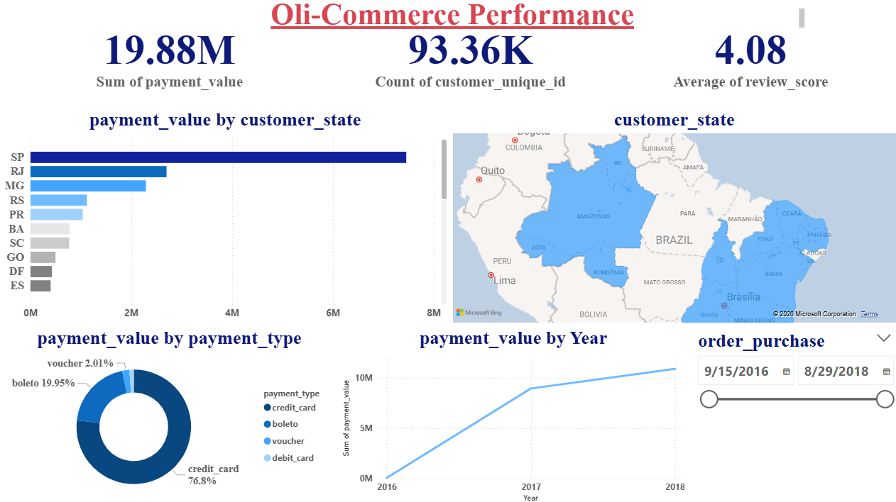

# 📊 Brazilian E-Commerce Analysis – Olist Dataset

## 📌 Project Overview
This project analyzes the **Brazilian E-Commerce Public Dataset by Olist** to uncover business insights related to customer behavior, delivery performance, payment methods, product categories, and sales trends. The main goal is to transform raw e-commerce data into actionable business recommendations.

---

## 🎯 Business Objectives
* **Analyze** customer satisfaction and review scores.
* **Understand** the impact of delivery delays on customer experience.
* **Identify** top-performing product categories.
* **Explore** customer payment behavior.
* **Detect** sales trends and seasonal peaks.
* **Analyze** geographic sales distribution.
* **Discover** customer retention opportunities.

---

## 🛠️ Tools & Technologies
* **Analysis:** Python (Pandas, Matplotlib, Seaborn)
* **Visualization:** Power BI & Excel
* **Querying:** SQL
* **Environment:** Google Colab / Jupyter Notebook

---

## 📂 Dataset Information
* **Source:** [Kaggle - Brazilian E-Commerce Public Dataset by Olist](https://www.kaggle.com/datasets/olistbr/brazilian-ecommerce)
* **Data Context:** The dataset contains 100k orders from 2016 to 2018 made at multiple marketplaces in Brazil.
* **Key Tables Used:**
  * `Orders`, `Customers`, `Payments`, `Products`, `Reviews`, `Sellers`, and `Geolocation`.

---

## ⚙️ Project Workflow (Step-by-Step)
1. **Data Acquisition:** Importing multiple datasets using Python.
2. **Data Cleaning:** Handling missing values and ensuring correct data types (especially date-time formats).
3. **Data Transformation:** Merging 7+ relational tables into a unified Master DataFrame.
4. **Exploratory Data Analysis (EDA):** Performing deep dives into sales behavior, logistics, and delivery delays.
5. **Dashboarding:** Building an interactive Power BI dashboard to track KPIs and provide a high-level business view.

---

## 📊 Key Insights

### 1️⃣ Logistics & Customer Satisfaction (The Gold Insight)
> **Problem:** Strong correlation between delivery delays and low review scores.
* **Findings:** Orders delivered early consistently get **4–5 stars**. Small delays of 2-3 days trigger **1–2 star** ratings.
* **Conclusion:** Delivery performance impacts satisfaction more than product quality.
* **Recommendation:** Improve shipping logistics and real-time tracking.

### 2️⃣ Payment Preferences (Consumer Behavior)
* **Findings:** Over **75%** of customers use **Credit Cards**. Installments are used for expensive items.
* **Recommendation:** Optimize installment options and speed up Boleto processing.

### 3️⃣ Peak Hours & Seasonality (Time Analysis)
* **Findings:** Peak sales occur between **2 PM – 4 PM** and **8 PM – 10 PM**. Major growth in late 2017 due to **Black Friday**.
* **Recommendation:** Launch campaigns during peak hours and seasonal spikes.

### 4️⃣ Geographic Hotspots (Location Analysis)
* **Findings:** **São Paulo** is the strongest hub. Distant regions face shipping costs of **30–40%** of the product price.
* **Recommendation:** Build regional warehouses to optimize costs.

### 5️⃣ Customer Loyalty (Retention Analysis)
* **Findings:** More than **95%** of customers purchase only once.
* **Recommendation:** Implement loyalty programs and personalized email marketing.

---

## 📈 Interactive Dashboard
The Power BI dashboard provides a visual and interactive deep dive into the business KPIs:
* **Sales Overview** & Time-Series Analysis.
* **Delivery Performance** (Actual vs. Estimated).
* **Payment Distribution** & Geographic Maps.

### Dashboard Preview:

---

## 📌 Skills Demonstrated
* **Data Cleaning & Transformation**
* **Exploratory Data Analysis (EDA)**
* **SQL Querying & Business Intelligence**
* **Storytelling with Data & Problem Solving**

---

## 📬 Contact & Connect
Let's connect and discuss data! 🚀

* **LinkedIn:** [
farah analyst
](www.linkedin.com/in/farah-analyst-2063072ba)
* **GitHub:** [@farah-analyst](https://github.com/farah-analyst)

⭐ **If you found this project useful, please consider giving it a star!**
